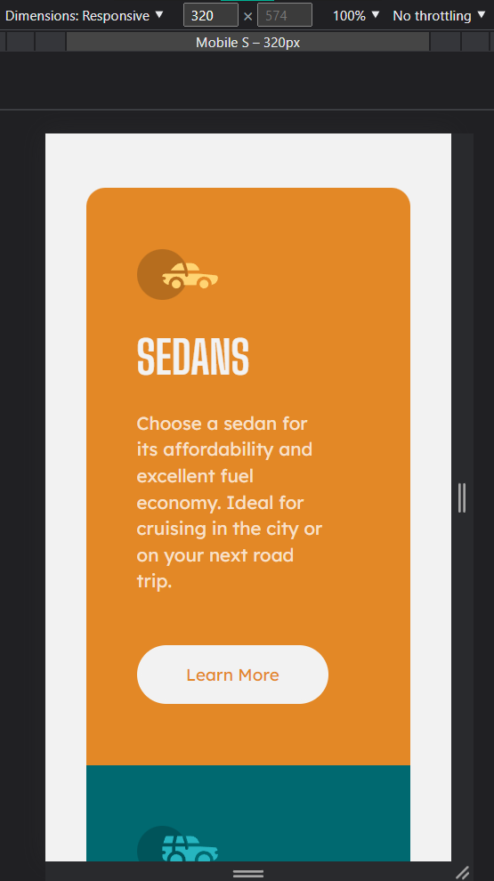

# Frontend Mentor - 3-Column Oreview Card Component

This is a solution to the [3-Column Preview Card Component challenge on Frontend Mentor](https://www.frontendmentor.io/challenges/3column-preview-card-component-pH92eAR2-). <br>
Frontend Mentor challenges help you improve your coding skills by building realistic projects. 

## Table of contents:

- [Overview](#overview)
  - [The challenge](#the-challenge)
  - [Screenshot](#screenshots)
  - [Links](#links)
- [My process](#my-process)
  - [Built with](#built-with)
  - [What I learned](#what-i-learned)
  - [Continued development](#continued-development)
- [Author](#author)
- [Acknowledgments](#acknowledgments)
- **New:** [Suggestions/Feedbacks](#suggestions)
- [Notes](#notes)


## Overview:

### The challenge:

Users should be able to:
- View the optimal layout depending on their device's screen size
- See hover states for interactive elements
- Get it looking as close to the design as possible.

<br>

Preview of initial design:


### Screenshots:

<div align="center"> 

| Fullscreen View (Desktop) | 
|---------|
|  |

| Animated Preview (Not sure if this is 100% accurate due to height limit of screen) | 
|---------|
|  |

<br>

**Note: This is a Mobile-First Approach**

<br>

All viewports were included (except for the 4k view), in case the observer wishes to see the minor changes.

<br>

| Desktop View (1440px) | Laptop View (1024px) | Tablet View (768px) |
|---------|---------|---------|
|  |  |  |

| Mobile L (425px) | Mobile M (375px) | Mobile Small (320px) | 
|---------|---------|---------|
|  |  |  |

</div>

### Links:
- Live Site URL: [Website Link - Click Me](https://3-column-prev-card-component.vercel.app/)
- Solution URL: [FrontEndMentor - Click Me](https://www.frontendmentor.io/solutions/3column-preview-card-component-mobilefirst-approach-flexbox-KaR_Tn8TXn)

## My process:

### Built with:
- HTML5
- CSS3
- Mobile-First Approach

### What I learned:

Recap over some of the major learnings while working through this project:

#### General things I've learned:
- Basic review of HTML & CSS
- CSS Flex Layout (More proficient and took faster in using it)
- Make more use of css variables to make the code more readable & clean
- Assign an initial static size in elements/containers before adjusting it or using display: flex  
  - This solves my previous problem that the container is too fluid.
  - Overusing of vw and vh in the adjusting size
  - Prevent and limits the element/container to resize too much when zooming out 

#### New things I've found/learned better:
- I realized that **creating a wireframe on paper and visualizing it made the overall process of finishing it faster**
- This is much faster for quick and small planning, compared to digital wireframing like utilizing Figma 
  - Here is the sample paper of my wireframe/layout plan before I open a code editor: 

  <br> 

  
- Visualizing flexbox is much easier because of initial planning.
- I started to think right now that front-end designing is 4:5 or 80% planning / 20% coding (I may be wrong about the ratio.)

<br>

This code snippets/function, is what **I'm proud to figure out**:

```css
@media screen and (min-width:768px) {  
  .card-main-info{max-height: 190px;}} 

@media screen and (min-width:820px) {
  .card-main-info{height: 180px;}}

@media screen and (min-width:920px) {
  .card-main-info{height: 185px;}}

@media screen and (min-width:1024px) {
  .card-main-info{height: 190px;}}

@media screen and (min-width:1440px) {
  .card-main-info{height: 160px;}}
/* I feel like this is an static/unefficient way of solving responsiveness. 
As it adjust the height manually from multiple media queries */
```


### Continued development:
<hr>

#### Here are a few possible areas that could be added or improved in the HTML and CSS code provided:
1. **Accessibility:** - It could be more accessible to users with disabilities by:
    - Include appropriate ARIA attributes, alt text, and semantic HTML tags. 
2. **Responsiveness:** - Using responsive design techniques and media queries for different screen sizes and devices.
3. **Browser Compatibility:** - Not all browsers support the same features and rendering of web pages from the CSS styles I used.
4. **Cleaner Maintainable Code** - I'm not quite sure about this one, but I'm sure there is a much better/cleaner approach to do what I did.

## Author:
- Github - [@Iron-Mark](https://github.com/Iron-Mark)
- Frontend Mentor - [@Iron-Mark](https://www.frontendmentor.io/profile/Iron-Mark)

## Acknowledgments:
- I would like to acknowledge the hard work and dedication I put into creating this website. 
- I am grateful for my friends and those who motivate me to push through and not settle for relaxation. 
- I hope that this website serves its intended purpose. Thank you!

## Suggestions:

### REPORTS (Accessibility report (4))

- Interactive controls must not be nested
```html
<button class="btn"><a href="https://github.com/Iron-Mark" target="_blank" rel="noferrer noopener">Learn More</a></button>
```

- Page should contain a level-one heading
```html
<html lang="en">
```

- Bad value "noferrer noopener" for attribute "rel" on element "a": The string "noferrer" is not a registered keyword.
- The element "a" must not appear as a descendant of the "button" element.
```html
<button class="btn">
  <a href="https://github.com/Iron-Mark" target="_blank" rel="noferrer noopener">`
</button>
```

### Community Feedback: 
- __Kamil__ • 90 [_(@Owczarek-Kamil)_](https://github.com/Owczarek-Kamil)
  - You should **not nest buttons** and **`<a>` tags together**
    - This also have been pointed out in the FrondEndMentor Accessibility report and HTML validation report.
    - In my opinion you should go with `<a>` tags and style them with pseudo classes like, `:link, :active, :hover, :visited`.
  - You should put `alt` on the icons. But **if the icons do not represent any UX purpose/their purpose is decorative one.**
    - `alt` should be left blank, 
    - And you should include `aria-hidden="true"`.
  - **Implement some hover animations** on buttons/links.
    - Right now the transition is instant and it is not very pleasing for the eyes :)
    - Simple `transition: all 300ms;` would do the work.

<br>

- __バレンタイン 😈__ • 61,400 [_(@Valentine-D3V)_](https://github.com/Valentine-D3V)
  - DO NOT FORGET to **check your FEM report** (It provides value information), 
    - To see what is incorrect and update your code with it. 
    - This should be done immediately after submitting your challenge.
  - **The `<section>` element is being used incorrectly** and not needed for this challenge.
    - You are using it to wrap each individual card in a `<section>` element instead of using a `<div>`.
    - The `section` element is meant group related content in full sites. They are not meant to contain small things like you did.
    - If this was part of a real site, the entire thing would be wrapped in a `section` and it will have an `h2` heading saying something like "Check out our models..."
  - The “car icons” in this component are purely decorative. 
    - **Their `alt` tag should be left blank** to remove them from assistive technology.
  - **`buttons` were created with the incorrect element**
    - When the user clicks on the button they should be directed to a different part of you site. 
    - The `a` anchor tag will achieve this.
  - There is **no need to have separate stylesheets**. Instead have one single stylesheet.
    - As it can affect site performance.

### Next Action (Soon):
- I'm going to review other people's code and how it was done.
- Learn from it and combine it with the suggestions
- Then re-create the website project.

## Notes:
- I would be happy to receive comments, criticism, and such that could improve the website:
  - Cleaner Code
  - Better Practice/Approach to making this website.
- Feel free to approach and contact me :>
- _Finished Feb, 5-6 2022 (Code) Feb, 7 2022 (Documentation) Feb, 10 2022 (Take Notes from Feedbacks)_
